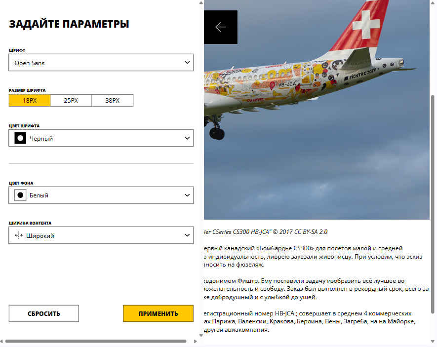

# Кастомизация страницы блога

Реализация логики работы в готовом приложении с использованием React. С моей стороны были добавлены компоненты состояния и обработчики событий, логика передачи данных между формой и страницей (реализовано открытие сайдбара и применение его настроек к странице)



## Стек

   

## Установка и запуск

Для установки и запуска проекта необходимо выполнить команды

```
npm install
npm run start
```

или

```
yarn
yarn start
```
